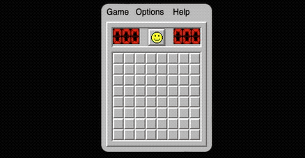
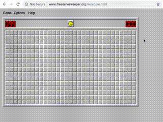

# SAT-based Classic MineSweeper Solver





## Introduction

This is an SAT-based MineSweeper solver.
It interactively plays online MineSweeper game provided by [freeminesweeper.org](https://freeminesweeper.org) through usual human-computer interface.
It detects the board by sliding window template matching and uncover the mines by simulating left/right mouse clicks.
It can play on all configuration of boards (height, width, number of mines).
It logs all events needed to reproduce the process -- at `logs/run.log` by default.
It detects whether it loses or wins.
Due to the new interface of freeminesweeper.org, it cannot begin a new round automatically now.

## How to use

### Online game

Open [freeminesweeper.org](https://freeminesweeper.org)'s minesweeper board page.
Be sure to expose the entire board on screen.
Now run command

```bash
# don't need to run this everytime
#python3 -m virtualenv rt

. rt/bin/activate

# don't need to run this everytime
#pip install -r requirements.txt

# run this to play without considering mines remaining
python -m mwagent

# run this to play taking into account mines remaining,
# where `-m99' below indicates that there are 99 mines
# in total, as in Expert level. you need to change
# this number according to the actual mines number
#python -m mwagent -m99

# run this to use a different solver than the default
# one. a list of solvers can be found by
# `python -m mwagent --help`
#python -m mwagent -Smcdfssolver
```

Then click and activate the web browser window containing the board.

Again, be sure not to overlap the Terminal window with the board.
Wait 10 seconds the computer will play on its own.

Enjoy watching it playing!

### One-step solution

Perform a one-step solution given a board.
Find example boards in [example\_boards](example_boards) (but not in `example_boards/key`).

```bash
python -m fullsatsolver example_boards/2.csv
#python -m mcdfssolver example_boards/2.csv
#python -m mcsatsolver example_boards/2.csv
```

### Virtual game

Given a board with all cells uncovered and the first-step solution, you may watch the program playing virtual Minesweeper game without opening the browser.
Find example boards in [example\_boards/key](example_boards/key).

```bash
python -m virtual.mwagent example_boards/key/1.csv
```

You may also switch different solver using `-S` option.
See more help by `python -m virtual.mwagent --help`.

The virtual games can be used to compare which solver is faster on which type of board.

## What if error occurs?

First of all, if you encounter `SyntaxError`, it could indicate that your Python is not latest enough.
This program is developed under Python-3.9.7, and is not tested in versions below, so no guarantee as for now.

If in the error message,

- `vboard.BoardNotFoundError` appears:
  it means that the game board cannot be localized
- `GameWontBeginError` appears:
  it means the program attempts to click somewhere but the screen does not change

But since there's no deep learning or the like in the user interface handler code, it's very brittle.
The above-mentioned error messages are likely to occur in otherwise circumstances as well.

There are a number of possible causes and solutions:

- the user interface of freeminesweeper.org changes:
  although I check and update the code handling the user interface from time to time, still it sometimes occurs;
  please wait for the next update or play with various parameters in `vboard.py`
- you are using the Retina display of Mac computers:
  try scaling your browser up or down before issuing the running command again;
- the browser containing the game interface is occluded by other windows:
  just put it to the front
- there are background windows containing distractive contents:
  try closing as many background windows as possible
- you forget to activate the browser window before the program makes its first click

There may also be unlisted causes.

## Mechanism

### `fullsatsolver`

The core mechanism is to convert current MineSweeper board into a CNF, and resort to [MiniSAT](http://minisat.se/), a fast SAT solver, to get the solution.
Due to lack of assumptions (e.g. certain key cells haven't been uncovered yet), it often occurs that a number of possible solutions are returned (up to 10000).
To disambiguate, I find the symbol that maintain its set/clear state the most throughout all solutions.
If that symbol is always set or always cleared, a.k.a. having mine underneath or otherwise, then it's definitely that state.
If that symbol is mostly one state but sometimes the other, then the former state is a better guess.
Although it's the best guess one can make, still it sometimes loses.
I take into account the number of mines remaining as soon as it's no longer intractable, giving higher accuracy.

### `mcdfssolver`

The core mechanism is to convert current MineSweeper board into a set of problems.
For example: c\_i1, c\_i2, ... c\_im have in total k mines.
Then I brute-force search (with pruning) all possible solutions in the set of problems.
However, when there are many problems, it becomes intractable to search all possibilities.
Therefore, I recursively bipartition the set of problems into smaller sets until the result set becomes tractable.
I bipartition using [global Min-cut algorithm](https://stanford.edu/~rezab/classes/cme305/W14/Notes/4.pdf), using problems as nodes and Jaccard similarity between problems as edge capacity.
In practice (I tried up to `40x80` board), `mcdfssolver` is 2x to 8x faster than `fullsatsolver`, and I haven't found any inconsistency between their results.

### `mcsatsolver`

This is a combination of the above two solvers.
It first partitions the problem into subproblems using global Min-cut, and then solve each subproblem using standard SAT solver.
In general, this solver is the fastest, especially if the board is large enough.

## Chording

I use chording to speed up uncovering tiles.
Since finding the optimal chording strategy is exponential time complexity (I didn't find better one), a greedy algorithm is used.
It's too long to explain it here.
If you want to know more, read the code [`actionplanner.py`](./actionplanner.py).

## Aggressive guessing

This function is by default turned off.
Aggressive guessing makes weighted random guess on empty cells if the mine density is small enough.
It sacrifices the probability to win for shorter time.
To enable this function, specify the total number of mines in a board, and adjust its two parameters off their default values.
For example,

```bash
python -m mwagent -D5 -m99 -Smcsatsolver \
    aggressive_guess_max_mine_density=0.22 \
    aggressive_guess_min_empty_density=0.75
```

Aggressive guessing in general will slow down `fullsatsolver`, but will not for partitioning-based algorithms like `mcsatsolver`.

## Statistical comparison of the solvers

See [statcmp.md](runs/statcmp.md).

## Future works

- Add debug mode where screenshots with markup of each click are saved to a specified folder
- Hierarchical definition of solvers, action planners, etc.

## More about Minesweeper

- [MinesweeperWiki](https://minesweepergame.com/website/authoritative-minesweeper/wiki/Main_Page)
- [Minesweeper Game World Ranking](http://www.minesweeper.info/worldranking.php?ranking=1&utm_source=wechat_session&utm_medium=social&utm_oi=971045615085588480)
